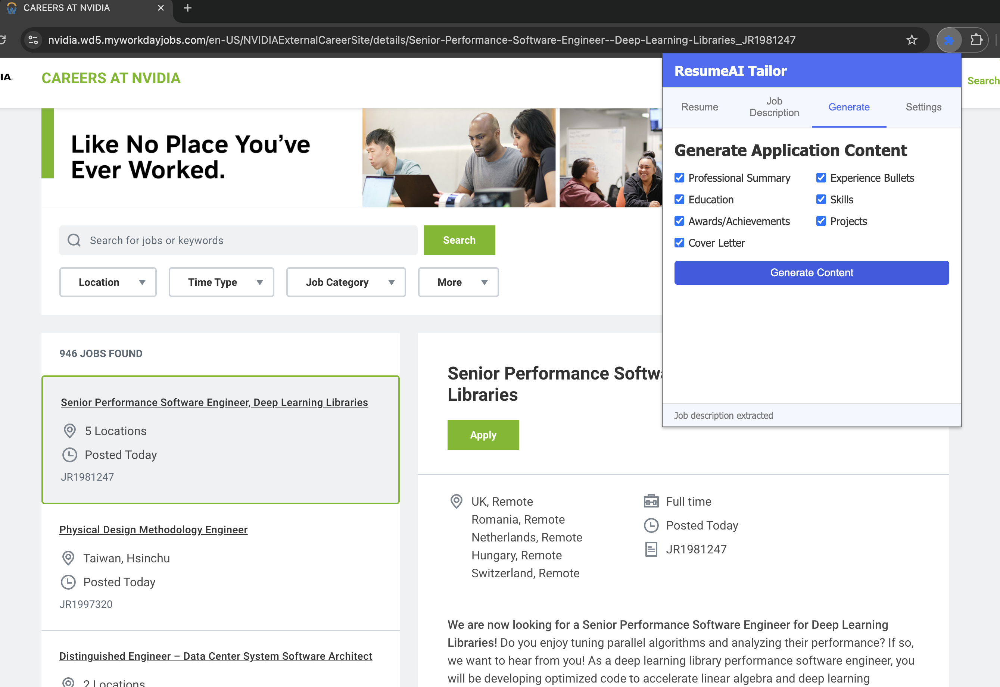

# ResumeAI Tailor

A browser extension that uses AI to tailor your resume and cover letter based on job descriptions. This tool helps you create customized application content for job applications on platforms like Workday, Greenhouse, and Lever.

## Features

- Upload and parse your resume (PDF or TXT)
- Extract job descriptions from job posting websites
- Generate personalized application content:
  - Professional summary
  - Experience bullets
  - Education details
  - Skills section
  - Awards/achievements
  - Projects
  - Cover letter
- Auto-fill application forms on supported job platforms
- Support for both OpenAI API and local Ollama models

## Installation

### Development Setup

1. Clone this repository:
   ```
   git clone https://github.com/yourusername/resumeai-tailor.git
   cd resumeai-tailor
   ```

2. Install dependencies:
   ```
   npm install
   ```

3. Run the extension in development mode:
   ```
   npm run dev
   ```

### Manual Installation in Chrome

1. Build the extension:
   ```
   npm run build
   ```

2. Open Chrome and navigate to `chrome://extensions/`
3. Enable "Developer mode" (top-right corner)
4. Click "Load unpacked" and select the `web-ext-artifacts` directory

## Usage

1. Click on the extension icon in your browser toolbar
2. Upload your resume in the "Resume" tab
3. Navigate to a job posting and use "Extract from Current Page" in the "Job Description" tab
4. Go to the "Generate" tab and select the content you want to generate
5. Click "Generate Content" to create personalized application materials
6. Use "Autofill Application" to automatically fill out application forms

## Screenshots

Here are some screenshots showcasing the ResumeAI Tailor extension:


*Resume Upload - Upload your resume in PDF or TXT format to be parsed by the extension*


*Job Description Extraction - Extract job details from the current page or paste them manually*


*Content Generation - Select what content you want to generate for your application*


*Generated Professional Summary - Example of a tailored professional summary based on your resume and the job description*


*Experience Bullets - AI-generated experience bullets highlighting relevant skills for the job*


*Cover Letter - Generate a personalized cover letter tailored to the job*


*Settings - Configure your AI provider preferences and API keys*


*Auto-fill Feature - The extension automatically filling job application forms*

## Configuration

In the "Settings" tab:
- Choose between OpenAI API or local Ollama for AI generation
- Enter your OpenAI API key or configure Ollama server URL
- Select the AI model to use for content generation

## Architecture

ResumeAI Tailor is built as a browser extension following Chrome's Extension Manifest V3 architecture. The extension is structured with a modular design to ensure maintainability, performance, and security.

### Project Structure

```
resumeai-tailor/
├── manifest.json          # Extension manifest
├── package.json           # Project dependencies and scripts
├── .gitignore             # Git ignore configuration
├── assets/                # Icons and other static assets
├── popup/                 # Popup UI
│   ├── popup.html         # Main popup HTML structure
│   ├── popup.js           # Main popup entry point (imports modules)
│   └── modules/           # Modular popup components
│       ├── tabs.js        # Tab navigation functionality
│       ├── resume.js      # Resume upload handling
│       ├── job-description.js # Job description handling
│       ├── content-generator.js # Content generation
│       ├── settings.js    # Settings management
│       └── ui-helpers.js  # UI utility functions
├── content/               # Content scripts
│   ├── jobfill-functions.js # Functions to interact with job sites
│   └── jobfill-styles.css # Styles for content script interfaces
├── background/            # Background scripts
│   └── background.js      # Background service worker
├── utils/                 # Utility modules
│   ├── storage.js         # Chrome storage operations
│   └── pdf-loader.js      # PDF parsing functionality
├── styles/                # CSS files
│   └── popup.css          # Styles for popup UI
└── lib/                   # External libraries
    └── pdf.js             # PDF parsing library
```

### Core Components

#### 1. User Interface (Popup)
- **Purpose**: Provides the main interface for users to interact with the extension
- **Key Files**: `popup/popup.html`, `popup/popup.js`
- **Features**:
  - Tab-based interface for different functionalities
  - Resume upload and parsing
  - Job description extraction and editing
  - Content generation with AI
  - Settings configuration

#### 2. Content Scripts
- **Purpose**: Interact with job posting websites to extract data and auto-fill forms
- **Key Files**: `content/jobfill-functions.js`
- **Features**:
  - Extract job descriptions from various job platforms
  - Identify form fields for auto-filling
  - Apply generated content to job application forms
  - Handle platform-specific DOM manipulation

#### 3. Background Service
- **Purpose**: Orchestrate communication and perform operations in the background
- **Key Files**: `background/background.js`
- **Features**:
  - Manage communication between popup and content scripts
  - Handle API calls to AI providers (OpenAI/Ollama)
  - Process data and construct AI prompts
  - Parse and structure AI responses

#### 4. Utility Modules
- **Purpose**: Provide reusable functionality across the extension
- **Key Files**: `utils/storage.js`, `utils/pdf-loader.js`
- **Features**:
  - Chrome storage operations
  - PDF parsing and text extraction
  - Data formatting and validation

### Data Flow

1. **Resume Processing**:
   - User uploads resume → PDF processing → Text extraction → Storage
   
2. **Job Description Extraction**:
   - User visits job site → Content script extracts job description → Data sent to popup → User can edit if needed

3. **Content Generation**:
   - User requests content generation → Resume and job data sent to background script → AI prompt constructed → API call made → Structured response parsed → Formatted content displayed to user

4. **Application Auto-fill**:
   - User initiates auto-fill → Generated content sent to content script → Form fields identified → Data mapped to appropriate fields → Forms filled

### AI Integration

The extension supports two AI backends:

1. **OpenAI API**:
   - Uses models like GPT-4/GPT-4o
   - Requires user's API key
   - Offers high-quality content generation

2. **Ollama (Local)**:
   - Runs locally using models like Llama 2
   - Privacy-focused option with no data leaving the user's computer
   - Requires local Ollama installation

### Security Considerations

- Resume and job data stored locally in Chrome storage
- API keys securely managed with appropriate permissions
- No unnecessary data transmission outside the extension
- Content scripts limited to specific job platforms

## Development

- `npm run dev`: Run the extension in development mode
- `npm run build`: Build the extension for production
- `npm run lint`: Lint the codebase
- `npm run test`: Run tests

### Extending the Extension

1. **Adding New Job Platforms**:
   - Create a new extraction function in `content/jobfill-functions.js`
   - Add the domain to the `matches` property in `manifest.json`

2. **Supporting New AI Providers**:
   - Add provider configuration in `popup/modules/settings.js`
   - Implement the API integration in `background/background.js`

3. **Enhancing the UI**:
   - Modify `popup/popup.html` and `styles/popup.css`
   - Add new UI components in `popup/modules/`

## License

MIT 